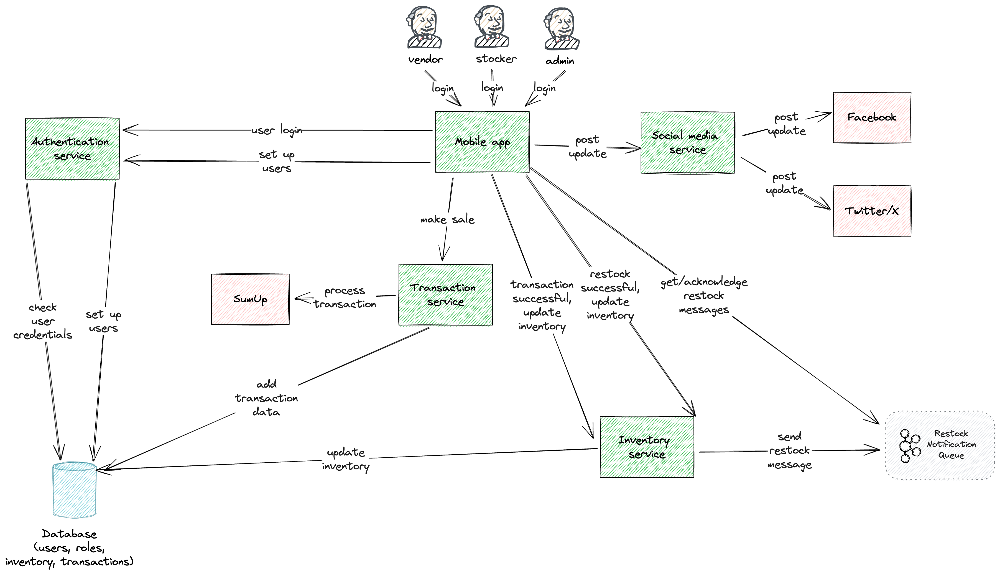
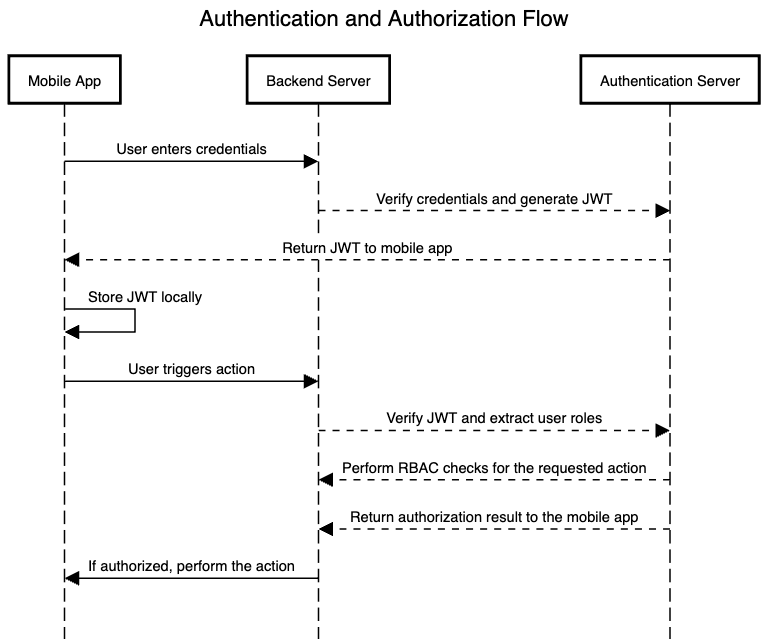

# Hot Diggety Dog
https://www.architecturalkatas.com/kata.html?kata=HotDiggetyDog.json

Local hot dog stand merchant wants a point-of-sale system for his hot dog stand operators

Requirements: must be lightweight in size--laptop is too unwieldy to use efficiently when making hot dogs on the street; allow for discounts; track sales by time and location; send inventory updates to mobile inventory-management staff (who drive to the location with supplies); provide a social-media integration so customers can be notified when a hot dog stand is nearby

Users: fifty or so hot dog stand operators, thousands of customers in the local area (via social-media)

## Contents
<!-- `make toc` to generate https://github.com/jonschlinkert/markdown-toc#cli -->

<!-- toc -->

- [Handy Links](#handy-links)
- [Analysis](#analysis)
  * [Container Diagram](#container-diagram)
  * [Components (so far)](#components-so-far)
  * [Mobile App](#mobile-app)
  * [Card Reader and SDK](#card-reader-and-sdk)
  * [Payment Processing](#payment-processing)
  * [Inventory Management](#inventory-management)
  * [Track Sales by Time and Location](#track-sales-by-time-and-location)
  * [Provide Social Media Updates](#provide-social-media-updates)
    + [Facebook](#facebook)
    + [Twitter/X](#twitterx)
  * [User Management and Authentication](#user-management-and-authentication)
    + [User Authentication Options](#user-authentication-options)
      - [Auth0](#auth0)
      - [Frontegg](#frontegg)
      - [AWS Cognito](#aws-cognito)
      - [Custom Built OAuth](#custom-built-oauth)
      - [Custom Authentication and Authorisation](#custom-authentication-and-authorisation)
  * [Risks](#risks)
  * [Non-Functionals](#non-functionals)
  * [Constraints](#constraints)
  * [Principles](#principles)
- [Notes](#notes)
- [User Authentication Versus App Authentication](#user-authentication-versus-app-authentication)
  * [User Authentication:](#user-authentication)
  * [App Authentication:](#app-authentication)
- [Typical Mobile App Flow for User Authentication and Authorisation](#typical-mobile-app-flow-for-user-authentication-and-authorisation)
  * [1. User Authentication:](#1-user-authentication)
  * [2. Performing an Action:](#2-performing-an-action)
  * [3. Authorization on the Server Side:](#3-authorization-on-the-server-side)
  * [4. UI Considerations:](#4-ui-considerations)
  * [5. Handling Token Expiry:](#5-handling-token-expiry)
  * [Security Considerations:](#security-considerations)
  * [Sequence Diagram](#sequence-diagram)
- [Integration with Facebook](#integration-with-facebook)
  * [1. Create a Facebook App:](#1-create-a-facebook-app)
  * [2. Obtain Page Access Token:](#2-obtain-page-access-token)
  * [3. Integrate Facebook SDK into Your App:](#3-integrate-facebook-sdk-into-your-app)
  * [4. Use the Graph API to Post:](#4-use-the-graph-api-to-post)
  * [Example (using cURL):](#example-using-curl)
  * [5. Handle Authentication:](#5-handle-authentication)
  * [6. Error Handling:](#6-error-handling)
  * [7. Testing:](#7-testing)
  * [Important Note:](#important-note)
- [Sending Posts to Twitter/X](#sending-posts-to-twitterx)
  * [1. Create a Twitter Developer Account:](#1-create-a-twitter-developer-account)
  * [2. Create a Twitter App:](#2-create-a-twitter-app)
  * [3. Obtain API Keys and Access Tokens:](#3-obtain-api-keys-and-access-tokens)
  * [4. Integrate Twitter API in Your App:](#4-integrate-twitter-api-in-your-app)
  * [5. Use the API to Post Tweets:](#5-use-the-api-to-post-tweets)
  * [Example (using cURL):](#example-using-curl-1)
  * [6. Handle Authentication:](#6-handle-authentication)
  * [7. Error Handling:](#7-error-handling)
  * [8. Testing:](#8-testing)
  * [Important Note:](#important-note-1)
- [Alternatives to Facebook SDK for React Native](#alternatives-to-facebook-sdk-for-react-native)
  * [1. **Use Custom Native Modules:**](#1-use-custom-native-modules)
  * [2. **Use Third-Party Libraries:**](#2-use-third-party-libraries)
  * [3. **Direct API Requests:**](#3-direct-api-requests)
- [SumUp Process](#sumup-process)

<!-- tocstop -->

## Handy Links

https://frontegg.com/ Ui for setting up things like OAuth or passwordless authentication.

## Analysis

### Container Diagram
This is a first pass at the services and messages for the solution. Excalidraw file [here](hotdiggetydog_container_firstpass.excalidraw), open in https://excalidraw.com/. 

To do: Decide on technology, consider more messages between services, where to host (AWS?), consider load balancing, database replication, caching. Do a proper C4 container diagram.



### Components (so far)
* Mobile app (possibly React Native) - user authorisation
* Authorisation service - for user authentication and token generation
* Inventory service - tracking inventory
* Social media service - post to Facebook, X/Twitter. Would need to be a page in the app to compose and send posts which the social media service would post
* Database - for inventory (and users with their roles?)
* Transaction service - to talk to SumUp
* SumUp (third party payment service)
* Queue for notifications

### Mobile App
This amounts to: design the Square, PayPal Here, Shopify POS apps.

No laptop, so a mobile app which connects to a card reader for taking card payments. 

What tech to use for mobile app? 

Separate depending on OS, meaning two codebases.

* iOS - Swift

* Android - Kotlin for modern Android development

Or cross-platform, one codebase, so: React Native.

But let developers ultimately decide this as they have more knowledge of this.

Something to bear in mind when it comes to integrating with social media sites like Facebook is the [End of Official Support for Facebook SDK for React Native](https://developers.facebook.com/blog/post/2021/01/19/introducing-facebook-platform-sdk-version-9/) announced 19th Janaury 2021.

It suggests some approaches, see `Alternatives to Facebook SDK for React Native` section below.

### Card Reader and SDK
App needs to take payments from card reader and call a system to process the payment.

Which card reader to use?

**SumUp Card Reader/SumUp SDK** - affordable, cross-platform, supports all card payment types, seems simplest.

Other card reader/SDK combos are:

* PayPal Here Card Reader/PayPal Here SDK
* Square Reader for Contactless and Chip/Square SDK
* Stripe Terminal/Stripe Terminal SDK

### Payment Processing

Choose a third party payment processor like:

* Stripe
* Square
* PayPal
* Adyen
* Authorize.Net
* Braintree
* Worldpay (FIS)
* **SumUp - as we're using their card reader and SDK we might as well use them for the actual payment processing**
* Shopify Payments

See `SumUp Process` below for a possible sequence of events when a sale is made.

To offer discounts on a product, we first need to have a payment page in the web app. It can show all products (retrieved from the database products table) along with the prices. There should be an option in the UI to set a discount on a product which would then change the amount in the request to SumUp.

Products will be:

`products`

| id | name    | price |
|----|---------|-------|
| 1  | hot dog | 3.00  |
| 2  | onions  | 0.00  |

So we don't charge for onions but we need to know we've used some for the purposes of inventory.

We don't bother tracking condiments.

Products are separate to inventory - products are what customers buy, inventory are the separate items that constitute a hot dog.

### Inventory Management

All possible inventory items.

* hot dogs
* hot dog buns
* onions
* ketchup
* mustard

A sale occurs. The hot dog vendor should be able to press a button saying hot dog (with quantity) or hot dog with onions (and quantity).

So add these to SumUp's item catalogue.

* hot dog
* hot dog with onions

We won't track these in SumUp but we want to know what products a transaction is for.

When we do a transaction we want to get the details of the transaction including the `products` array of objects.

We send how many hot dogs were sold to our inventory service which will update a MySQL database containing stock.

For a hot dog, it will subtract from the inventory service:

* 1 hot dog
* 1 hot dog bun

For a hot dog with onions it will subtract from the inventory service:

* 1 hot dog
* 1 hot dog bun
* 1 onion portion

We need to know how much stock each hot dog vendor has so there will need to be these tables in the database:

`stock` 

| id | name                    |
|----|-------------------------|
| 1  | hot dog                 |
| 2  | hot dog bun             |
| 3  | onion portion |

`vendors`

| id | name |
|----|------|
| 1  | joe  |
| 2  | mack |
| 3  | rich |

`vendors_stock`

| stock_id | vendor_id | quantity |
|----|-----------|----------|
| 1  | 1         | 200      |
| 2  | 1         | 200      |
| 3  | 1         | 200      |

We won't bother tracking ketchup and mustard, the vendor will get a full bottle of each at the start of the day. Too fussy to track this.

The inventory system will send an alert to all inventory managers when stock gets to a configured value like 25 on any of the stock items. They can bike over bags of hot dogs, buns and onions and then amend the stock for a vendor on the app.

Let's assume you get:

* 200 hot dogs per bag
* 200 hot dog buns per bag
* 200 onion portions per bag

This makes it easy to know how many items to re-add.

How do the stockers know which vendor to go to? When a sale is made, the vendor's location from their phone can be sent along with the transaction data. This data is also available from the SumUp response. Once the transaction is complete, the transaction service (or the phone app) can update inventory using the inventory service. If the inventory response shows inventory levels have hit a threshold for hot dogs, hot dog buns or onion portions, it can use the location data of the phone or SumUp response to send a request to the app to create a notification for all `stocker` users, so they know what supplies to take, the vendor who needs them, and their location.

What if no stockers are logged in at the time? Notifications should be added to a queue. The phone app should be able to access the queue for anyone logging in as a stocker.

When a stocker logs in they get the notification. Do we just notify one stocker, some or all? Notifications need to be acknowleged. So send the notification to all logged-in stockers. Each stocker should see the notification once but be able to see them in an area of the app as well.

When a stocker acknowledges a notification it's removed from the queue and they are expected to go and restock the vendor.

Possible restock message format:

```json
{
  "vendor_id": "13232",
  "location": {
    "lat": 23455.3,
    "lon": 10928.1
  },
  "stock": [
    {
      "id": 2, // e.g. hot dog buns
      "units": 200 // need 200 buns i.e. 1 bag of 200 buns
    },
    {
      "id": 3, // e.g. onion portions
      "units": 400 // need 400 onion portions i.e. 2 bags of 200 onion portions
    }
  ]
}
```


When a vendor is restocked, we need to update inventory for that vendor. The stocker needs to press something in the app to say they provided the requested stock. The requested stock would be appear in text boxes so they could edit it if they brought more or different stock. Submitting this would update the database via the inventory service.

There is no requirement to track overall stock.

### Track Sales by Time and Location

A SumUp transaction has:

* unique ID
* timestamp
* internal_id (i.e. internal unique ID on the SumUp platform)
* location object (including lat(itude) and lon(gitude) from the payment terminal reader)

So we have all the time and location data we need, no need for extra functionality in our app.

### Provide Social Media Updates

Use Facebook, Twitter APIs to post things from within the app. 

Provide a page in the app where posts can be composed and sent. The social media service would receive these and send them to the selected social media sites.

#### Facebook
Set up a page for the hot dog business on Facebook that users can subscribe to.

Facebook users who subscribe will see posts in the page.

See `Sending Posts to Facebook Page` section below.

#### Twitter/X

Twitter users would follow the hot dog company account and see posts that could be posted from within the app.

You can have personal or business accounts, think persona will suffice.

See `Sending Posts to Twitter/X` section below.

### User Management and Authentication
Some users are people selling hot dogs and taking payments. They can post on social media.

Some users are mobile inventory management staff who should receive inventory notifications so they can restock a vendor at a known location.

Some users need to see all payments, inventory, sales by time and location, so they're the admins.

Roles

* **vendor** - make payments, post on social media
* **stocker** - receive notifications of low supplies at a given hot dog stand so they can go and resupply
* **admin** - can do all of the above and see all sales information, and manage users and change their roles

It's typical for multiple individuals in a small business to use the same SumUp account.

So when a user is logged in, they can use the one SumUp account. The app would contact a separate transaction service and it would talk to the SumUp API and return the results back to the app.

#### User Authentication Options
##### Auth0
[00-login-hooks](00-login-hooks) - a React Native OAuth solution created by Auth0, that uses Google, Twitter, Facebook etc for logging in users.

Auth0 lets us create users, and roles with permissions.

Not free, if we have 50 users per day that's 50x30=1,500 Monthly Active Users.

Users may log in multiple times a day if their sessions expires, so could be up to 5 logins per user per day?

5x50x30=7,500 Monthly Active Users

This is really close to the 7,000 free users you get in the free tier.

**Price: The Essentials tier with 7,000 MAU is $160 per month. Max users is 10,000.**

##### Frontegg

[app-with-frontegg](app-with-frontegg) - a React app integrating with a Frontegg solution.

The app was created by following this https://portal.frontegg.com/development/settings/integration

Selected React followed by TypeScript + SWC.

Then followed instructions in the link above.

The Frontegg solution in the Builder page is:


i.e. Google login with `Allow signup` enabled.

Had to set up the Google side following https://docs.frontegg.com/docs/google-login.

When setting the OAuth 2.0 Client ID in Google, the `Authorized redirect URIs` didn't work with http://localhost:5173/account/social/success.

Had to use the Frontegg endpoint instead https://app-al0s8azy1prn.frontegg.com/oauth/account/social/success.

The base URL could be seen in Frontegg - Development - Env settings - General tab.

Then got the client id and secret from Google.

Went to Frontegg - under the Development env's Social Logins page clicked Manage for Google.


Added the client id and secret here and the callback as well.

The callback URI was my app's endpoint running locally i.e. http://localhost:5173/account/social/success

**Price: Starter $99 per month, Professional $799 per month.**

##### AWS Cognito
https://aws.amazon.com/pm/cognito/

**Price: https://calculator.aws/#/addService/Cognito says 7,500 MAU is free. Max is 50,000 MAU.**

https://docs.aws.amazon.com/cognito/latest/developerguide/cognito-integrate-apps.html

https://docs.aws.amazon.com/cognito/latest/developerguide/user-pools-API-operations.html

There's a learning curve with this but as it's free and it provides OAuth 2.0 and lets you administer user's roles and permissions, maybe should go with this.

##### Custom Built OAuth
There are examples of implementing OAuth all over the internet. It would be handy if we didn't have to roll our own authentication and authorisation, and roles and permissions for users, so maybe go for AWS Cognito.

**Price: Free**

##### Custom Authentication and Authorisation
Come up with own approach like username and password, user gets a token signed by our own auth service.

Use RBAC for the user authorisation?

Refer to https://mobile-security.gitbook.io/mobile-security-testing-guide/general-mobile-app-testing-guide/0x04e-testing-authentication-and-session-management

**Price: Free**

### Risks
* AWS Cognito 
  * If we use AWS Cognito for authentication, authorisation and permissions and roles for users using OAuth2.0 and Google/Facebook, etc logins, it will be a risk if the dev team aren't familiar with Cognito or OAuth 2.0.
* Custom Authentication and Authorisation
  * Dev team would need to know how to implement their own auth.

### Non-Functionals

### Constraints

### Principles

## Notes
## User Authentication Versus App Authentication
User authentication and app authentication are two distinct processes within a mobile app, each serving a different purpose.

### User Authentication:

**Definition:**
User authentication is the process of verifying the identity of an individual user, ensuring that the person trying to access the app or certain features within it is indeed who they claim to be.

**Purpose:**
1. **Access Control:** User authentication is primarily used for controlling access to the app and its features. It ensures that only authorized users can log in and interact with the app's functionalities.

2. **Data Security:** By authenticating users, the app can associate actions and data with specific individuals, helping to secure sensitive information and prevent unauthorized access.

3. **Personalization:** User authentication enables personalization features, allowing the app to customize the user experience based on individual preferences and settings.

**Methods:**
- **Password-based:** Traditional username and password authentication.
- **Biometric:** Utilizing fingerprints, facial recognition, or other biometric data.
- **Multi-Factor Authentication (MFA):** Combining multiple authentication factors for enhanced security.

### App Authentication:

**Definition:**
App authentication, on the other hand, refers to the process by which a mobile app itself is authenticated with backend servers, APIs, or other services it interacts with. It ensures that the app can securely communicate with external resources.

**Purpose:**
1. **API Access:** App authentication is crucial when the mobile app needs to interact with external services or APIs. It allows the app to prove its identity to these services to gain access.

2. **Data Exchange:** Securely exchanging data between the app and server, ensuring that the information sent and received is protected from unauthorized access.

3. **Authorization:** App authentication is often tied to authorization mechanisms, ensuring that the app has the necessary permissions to perform certain actions or access specific resources.

**Methods:**
- **API Keys:** Using a unique key associated with the app to authenticate requests made to the server or API.
- **OAuth (Client Credentials Grant):** Authenticating the app itself (as opposed to a user) to obtain an access token for accessing protected resources.
- **Certificates:** Employing digital certificates to establish a secure connection between the app and server.

**Key Differences:**

1. **Scope:**
  - **User Authentication:** Verifies the identity of individual users.
  - **App Authentication:** Verifies the identity of the app or service.

2. **Access Control:**
  - **User Authentication:** Controls access to app features based on individual user identity.
  - **App Authentication:** Controls access to external services or resources that the app interacts with.

3. **Credentials:**
  - **User Authentication:** Involves user-specific credentials (e.g., username, password).
  - **App Authentication:** Involves app-specific credentials (e.g., API keys, client credentials).

In summary, user authentication is focused on verifying the identity of individual users to control access to app features, while app authentication is about ensuring that the app itself is securely authenticated when interacting with external services or APIs. Both processes are essential components of a comprehensive mobile app security strategy.

## Typical Mobile App Flow for User Authentication and Authorisation
Here's how you would ensure a user can perform an action in a React Native mobile app:

### 1. User Authentication:

- **Login Screen:**
  - Build a login screen where users can enter their username and password.

- **Authentication Request:**
  - When the user submits the login form, send an authentication request to the backend server with the entered credentials.

- **JWT Handling:**
  - If authentication is successful, store the JWT securely on the mobile device. React Native provides options like AsyncStorage or secure storage for this purpose.

### 2. Performing an Action:

- **Action Trigger:**
  - When a user tries to perform an action that requires authorization, such as accessing a particular screen or making a specific request, trigger the action within the React Native mobile app.

- **Include JWT in Requests:**
  - Include the JWT in the Authorization header of the HTTP request when making requests to the backend server. This allows the server to identify and authenticate the user.

### 3. Authorization on the Server Side:

- **Token Verification:**
  - On the server side, verify the JWT for each incoming request to ensure it's valid, not expired, and hasn't been tampered with. Extract the user information and roles from the token.

- **RBAC Checks:**
  - Perform RBAC checks based on the user's roles to determine whether the user has the necessary permissions to perform the requested action.

- **Response Handling:**
  - If the user has the required permissions, proceed with the action. If not, return an appropriate error response (e.g., HTTP 403 Forbidden).

### 4. UI Considerations:

- **Conditional Rendering:**
  - In the React Native mobile app, use conditional rendering to display or hide UI components based on the user's roles and permissions. For example, you might conditionally render buttons or screens based on the user's authorization level.

### 5. Handling Token Expiry:

- **Token Expiry Checks:**
  - Implement logic on the mobile app to check the expiration of the JWT. If the token is expired, prompt the user to re-authenticate or refresh the token if a refresh token mechanism is in place.

### Security Considerations:

- **HTTPS:**
  - Ensure that the mobile app communicates with the server over HTTPS to secure data transmission.

- **Token Storage:**
  - Store tokens securely on the mobile device and follow best practices for securing sensitive information.

- **Secure Data Transmission:**
  - Implement secure data transmission practices, especially when dealing with sensitive user information or actions.

### Sequence Diagram


## Integration with Facebook
To allow your smartphone app to send posts to a Facebook Page, you can use the Facebook Graph API. Here are the general steps to achieve this:

### 1. Create a Facebook App:

- Go to the [Facebook Developers](https://developers.facebook.com/) website, log in with your Facebook account, and create a new app. This app will be associated with the Facebook Page to which you want to post.

### 2. Obtain Page Access Token:

- Get a Page Access Token for the Facebook Page associated with your app. You can obtain this token by following the authentication process detailed in the Facebook Graph API documentation.

### 3. Integrate Facebook SDK into Your App:

- Depending on your app's platform (iOS, Android, etc.), integrate the Facebook SDK into your mobile app. Follow the documentation provided by Facebook for the specific platform.

    - For Android: [Facebook SDK for Android](https://developers.facebook.com/docs/android/)
    - For iOS: [Facebook SDK for iOS](https://developers.facebook.com/docs/ios/)

### 4. Use the Graph API to Post:

- Use the Graph API to post content to the Facebook Page. The endpoint for posting to a Page's feed is typically:

    ```
    POST /v12.0/{page-id}/feed
    ```

  Here, `{page-id}` is the ID of the Facebook Page where you want to post.

  Include the necessary parameters, such as the message, link, image, or other content you want to post. Ensure that you have the `publish_pages` permission for the Page.

### Example (using cURL):

```bash
curl -X POST \
  -d "message=Your message here" \
  -d "access_token=YOUR_PAGE_ACCESS_TOKEN" \
  "https://graph.facebook.com/v12.0/{page-id}/feed"
```

### 5. Handle Authentication:

- Ensure that your app properly handles user authentication and authorization to obtain the necessary permissions to post on behalf of the user.

### 6. Error Handling:

- Implement error handling to manage cases where the post cannot be published.

### 7. Testing:

- Thoroughly test your implementation to make sure that posts are being successfully sent to the Facebook Page.

### Important Note:

- Keep in mind that Facebook's API and SDKs may evolve, and it's crucial to refer to the most up-to-date [Facebook Developers documentation](https://developers.facebook.com/docs/) for accurate information.

- Be aware of Facebook's policies and guidelines regarding automated posting, and ensure that your app complies with these policies to avoid any issues.

By following these steps, your smartphone app should be able to send posts to a Facebook Page using the Facebook Graph API.

## Sending Posts to Twitter/X

To achieve a similar goal of posting tweets to a Twitter account from your smartphone app, you can use the Twitter API. Here are the general steps:

### 1. Create a Twitter Developer Account:

- Go to the [Twitter Developer](https://developer.twitter.com/en/apps) portal, sign in with your Twitter account, and create a new developer account if you haven't already.

### 2. Create a Twitter App:

- Once your developer account is set up, create a new Twitter App. This will provide you with API keys and access tokens necessary for authentication.

### 3. Obtain API Keys and Access Tokens:

- After creating the app, navigate to the "Keys and Tokens" section to obtain the API key, API secret key, Access token, and Access token secret.

### 4. Integrate Twitter API in Your App:

- Depending on your app's platform (iOS, Android, etc.), integrate the Twitter API into your mobile app. Twitter provides SDKs and libraries for different platforms. Refer to the [Twitter Developer Documentation](https://developer.twitter.com/en/docs) for the specific SDK or library that suits your needs.

    - For Android: [Twitter for Android](https://developer.twitter.com/en/docs/twitter-for-android)
    - For iOS: [Twitter Kit for iOS](https://developer.twitter.com/en/docs/twitter-kit/ios)

### 5. Use the API to Post Tweets:

- Use the Twitter API to post tweets. The endpoint for posting tweets is typically:

    ```
    POST /1.1/statuses/update.json
    ```

  Include the necessary parameters, such as the status (text of the tweet) and any other relevant information.

### Example (using cURL):

```bash
curl -X POST \
  -H "Authorization: OAuth YOUR_OAUTH_HEADER" \
  -d "status=Your tweet here" \
  "https://api.twitter.com/1.1/statuses/update.json"
```

### 6. Handle Authentication:

- Ensure that your app properly handles user authentication and authorization to obtain the necessary tokens to post on behalf of the user.

### 7. Error Handling:

- Implement error handling to manage cases where the tweet cannot be published.

### 8. Testing:

- Thoroughly test your implementation to ensure that tweets are being successfully sent to the Twitter account.

### Important Note:

- Keep in mind that Twitter's API and SDKs may evolve, and it's crucial to refer to the most up-to-date [Twitter Developer Documentation](https://developer.twitter.com/en/docs) for accurate information.

- Be aware of Twitter's policies and guidelines regarding automated tweeting, and ensure that your app complies with these policies to avoid any issues.

By following these steps, your smartphone app should be able to post tweets to a Twitter account using the Twitter API.

## Alternatives to Facebook SDK for React Native

Here are alternative steps you can take to integrate Facebook with your React Native app:

### 1. **Use Custom Native Modules:**

You can still integrate with Facebook by using custom native modules. This involves writing your own bridge between the React Native JavaScript code and the native Facebook SDKs for iOS and Android. This approach requires knowledge of native development languages (Objective-C/Swift for iOS, Java/Kotlin for Android).

1. **iOS:**
    - Integrate the Facebook SDK for iOS using CocoaPods or manually linking the SDK.
    - Write a custom React Native Native Module that wraps the necessary iOS functionality.
    - Expose the module to React Native JavaScript.

2. **Android:**
    - Integrate the Facebook SDK for Android using Gradle or manually linking the SDK.
    - Write a custom React Native Native Module that wraps the necessary Android functionality.
    - Expose the module to React Native JavaScript.

### 2. **Use Third-Party Libraries:**

Consider using third-party libraries that provide React Native wrappers for the Facebook SDK. These libraries may continue to be maintained by the community even if the official support is discontinued. However, be cautious and check the library's documentation and GitHub repository for recent updates and community support.

### 3. **Direct API Requests:**

If you have specific requirements and the above approaches do not meet your needs, you can make direct API requests to the Facebook Graph API using standard HTTP requests from your React Native app. This way, you bypass the SDK and handle the integration manually.

Keep in mind that the field of technology is dynamic, and new solutions may emerge. Always check the latest updates, community discussions, and alternative libraries that may offer support for Facebook integration in React Native beyond the official SDK.

Remember to comply with Facebook's developer policies and guidelines, and ensure that your application follows best practices for handling user data and authentication.

## SumUp Process
The sequence of events for a SumUp transaction through your smartphone app involving a SumUp card reader typically involves several steps. Below is a general outline of the process:

1. **User Initiation:**
    - The user initiates a sale or transaction within your smartphone app. This could involve selecting products/services, entering the transaction amount, and choosing to proceed with a card payment.

2. **Payment Request:**
    - Your smartphone app sends a payment request to your transaction service, indicating the transaction details, including the amount to be charged.

3. **SumUp Integration:**
    - Your transaction service communicates with SumUp's API to initiate the card payment process. This involves generating a payment request to SumUp, which will be processed through the SumUp card reader.

4. **SumUp Card Reader Interaction:**
    - The SumUp card reader connects to the smartphone app, typically using Bluetooth. The customer inserts or taps their payment card into the SumUp card reader.

5. **Card Data Encryption:**
    - The SumUp card reader encrypts the card data and securely communicates it to SumUp's servers for processing. The encryption ensures the security of sensitive payment information.

6. **Transaction Processing:**
    - SumUp processes the payment transaction using the provided card data and communicates the result (approval or decline) back to your transaction service.

7. **Transaction Response:**
    - Your transaction service receives the response from SumUp and updates the transaction status in your app. If the transaction is approved, the sale is considered successful. If it's declined, appropriate actions can be taken, such as notifying the user.

8. **Receipt and Confirmation:**
    - Upon successful completion of the transaction, your app may generate a receipt for the customer. The SumUp API or your transaction service may provide details for creating and presenting receipts.

9. **Backend Accounting and Reporting:**
    - Your transaction service logs the transaction details, updating your backend systems for accounting purposes. This may include storing transaction records, generating reports, and updating inventory if applicable.

10. **User Feedback:**
    - Your app provides feedback to the user, confirming the success or failure of the transaction. This may include on-screen messages, notifications, or email receipts.

It's important to note that the specifics of the integration may vary based on the SumUp API version, SDKs used, and any specific features your app implements. Always refer to the official documentation provided by SumUp for accurate and up-to-date information on integrating their services into your app. Additionally, ensure that your app complies with relevant security and compliance standards for handling payment transactions.