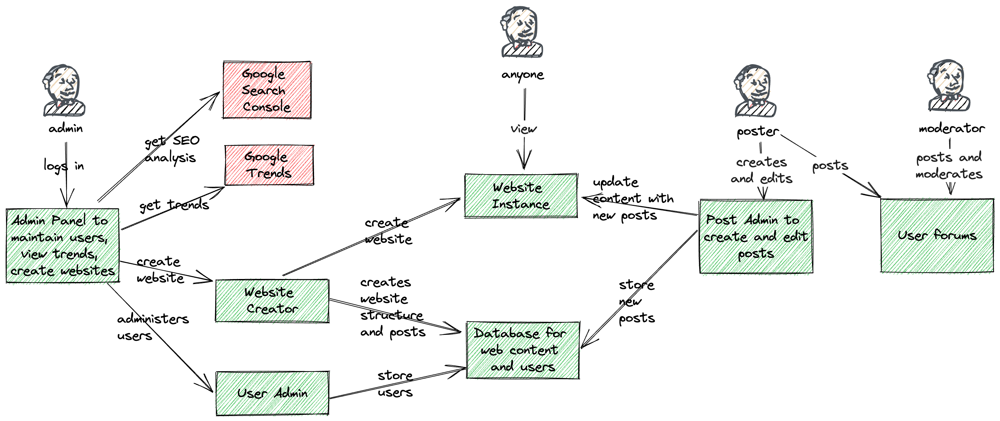

## I Can Haz Cheezborger?
https://www.architecturalkatas.com/kata.html?kata=Cheezborger.json

Client wants to create websites to follow Internet trends--as a new trend is identified, create a website following it and highlighting it and allowing users to interact with it

Users: millions+ readers, thousands+ posters, dozens admins

Requirements: high SEO; easy for users to add content; easily mashable/clickable; reject inappropriate content; easy trend analysis; user forums; user moderators; ubiquitous accessibility; easy admin "reach"/accessibility

### Analysis

> Whoa. This is a biggie to do as the first one. Postponing to work on something else.

* as a new trend is identified, create a website following it and highlighting it and allowing users to interact with it x
* thousands+ posters
* dozens admins x
* high SEO x
* easy for users to add content x
* easily mashable/clickable
* reject inappropriate content x
* easy trend analysis x
* user forums x
* user moderators x
* ubiquitous accessibility
* easy admin "reach"/accessibility

Let's say the new websites aren't created automatically, a human needs to click a button to create it.

A superadmin logs into an admin page that lets them see trends. They can create a new website based on a trend.

It will create the website as a new domain name, buying it for you if available. Can use https://dnsimple.com/api to buy domain names. Or AWS SDK to get domain names with Route 53.

AWS website hosting options: https://beabetterdev.com/2021/01/24/website-hosting-options-on-aws-picking-the-right-option-for-you/

Create website under the new domain name using a template

AWS Hosting options:

* static website in an S3 bucket
  * from AWS website hosting options link above:
    > In summary, Static Hosting with S3 is Great For:
    > 
    > Websites that won’t change very often, such as a business website.
  * we want to keep adding posts to our websites so the above point makes S3 seem unsuitable for our case
* WordPress Hosting with Amazon Lightsail
  * do we want to integrate with WordPress or have our own website posting service? Probably the latter
* Single Page Apps with AWS Amplify
  * can be expensive if don't know what you're doing
* Elastic Beanstalk
  * same here, and feels like Amplify supersedes it
* a Fargate container
  * from options link above:
  > In summary, EC2 or ECS are Great For:
  > 
  >Folks looking for enterprise level scale-abiltiy (millions of users)
  * This feels like what we need, satisfying the millions of users requirement
  * But what web server tech do we use? https://www.elegantthemes.com/blog/wordpress/best-web-servers-for-windows-and-linux
  * Apache - no - Apache can struggle with extremely high-traffic sites.
  * Tomcat - no - best for Java apps
  * **NGINX - probably - good for high traffic**
  * LiteSpeed - maybe - good for high traffic, optimised for PHP
  * CentOS Stream - good for devving apps so prob no good for prod
  * Caddy - maybe - focus on security
  * Lighttpd - no - doesn't seem especially great
  * Microsoft IIS - no - not available for Linux, Windows only
  
Can we programatically send a new container to Fargate? Not sure how practical or possible this is.

User admin - superadmins can maintain post-admins 

With AWS Amplify Hosting domain names and SSL handled for you. Or if it doesn't AWS SDK route53domain can register domains.

Use AWS SDK to create a new app under AWS Amplify.

There is a post-admin page where post-admins can add to a website but not create new ones.

Content moderation - issue guidelines and allow anyone to flag inappropriate content to a human moderator to handle. Use ML to reject inappropriate content automatically.

Normal readers with no admin rights can click into the main website and see featured websites.

For SEO analysis can use the Google Search Console API client library for Go (alpha).

User forums - can be a section under the main trends website, maybe a separate service. React front-end, Go backend? If we use Go for rest of site then just go with that again.

Users from most to fewest permissions

* Superadmin - can create new websites, administer users, look at trends and SEO analysis, and perform all actions
* Moderator - moderator is a website/forum poster with some extra permissions to delete inappropriate forum and website posts and contact users
* Poster - someone who can create and edit their own posts on previously-created websites. Can also post in user forums

### Useful Resources
**How to get high SEO**

https://www.mtu.edu/umc/services/websites/seo/

Google search console https://developers.google.com/search/docs/fundamentals/seo-starter-guide?__hstc=20629287.d5853afd34ae642d48994caec2c3ebf1.1691405744287.1691405744287.1691405744287.1&__hssc=20629287.1.1691405744287&__hsfp=225399707

**Identifying trends**

https://trends.google.com/trends - do we want global or country-specific trends?

Automatically create website

Automatically buy domain name

**Content moderation**

https://www.techtarget.com/whatis/feature/Content-moderation-guidelines-to-consider#:~:text=There%20are%20several%20ways%20to,report%20unacceptable%20behavior%20or%20content.

**Tool to view trends**

### Diagram (WIP)

https://excalidraw.com/#json=AZwYQ6Fh8Sf4fyEGLGVQn,vRUKdtT7458vsmquVCK9ew

